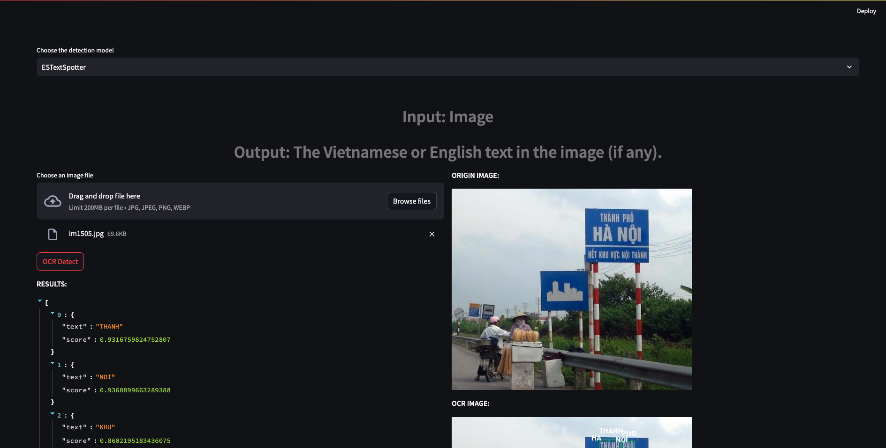

# VietnameseOCR
1. Set up environment
```
conda create -n ocr python=3.8
conda activate ocr
```
2. Install requirements.txt
```
pip install -r requirements.txt
```
3. Install setup
```
python setup.py build develop
```
4. Run the demo. It will take some time to init the demo
```
streamlit run app.py
```

The demo will be like that
